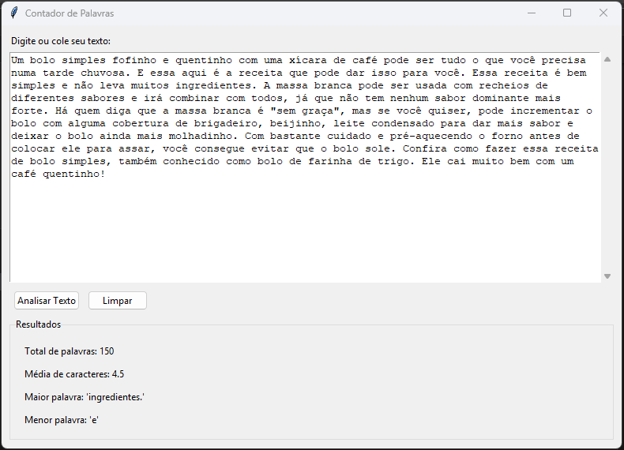

# Contador de Palavras 📝

Um programa simples e eficiente para contar palavras em textos, com suporte a diferentes idiomas e formatos.

## Novidades da Versão 1.2 🎉

### Interface Gráfica!
Agora com uma interface gráfica moderna e fácil de usar:

  

#### ✨ Principais Recursos:
- **Interface intuitiva** com área de texto ampla
- **Análise em tempo real** dos textos
- **Resultados detalhados:**
  - Contagem total de palavras
  - Média de caracteres por palavra
  - Identificação da maior e menor palavra
- **Botões de ação rápida:**
  - Analisar Texto: Processa instantaneamente o conteúdo
  - Limpar: Reinicia a aplicação
